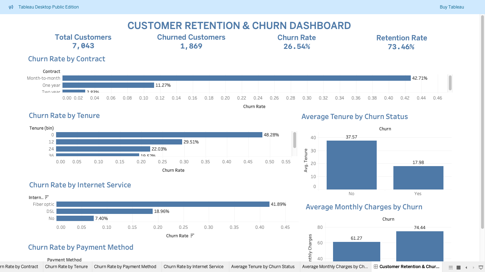
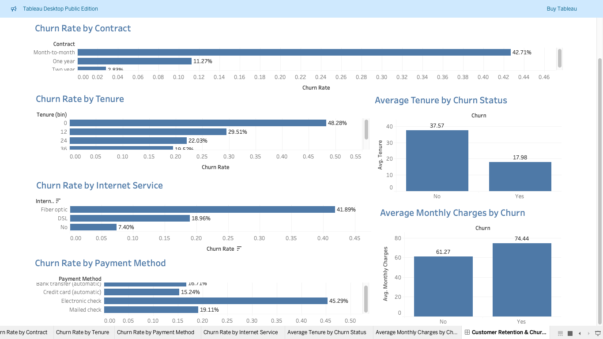

# Customer Retention & Churn Analysis

## Future Interns – Data Science & Analytics Task 2

This project analyzes customer and subscription data to understand customer churn, retention patterns, customer lifetime trends, and factors associated with customer churn.

## Objectives

- Analyze customer churn and retention
- Identify important churn drivers
- Analyze customer tenure and lifetime patterns
- Compare churn across customer segments
- Generate actionable recommendations to improve retention

## Dataset

**Dataset:** Telco Customer Churn Dataset

- Total Customers: 7,043
- Total Columns: 21
- Churned Customers: 1,869
- Retained Customers: 5,174

## Data Cleaning

- Checked missing values
- Converted `TotalCharges` to numeric format
- Handled missing `TotalCharges` values
- Checked duplicate records
- Created `Churn_Flag`
- Created tenure-based customer groups

### Cohort Analysis Note

The dataset does not contain a customer signup date, so signup-month cohort analysis is not possible. Instead, customers are grouped into tenure-based cohorts to analyze retention and churn patterns across different stages of the customer lifecycle.

## Key KPIs

| KPI | Value |
|---|---:|
| Total Customers | 7,043 |
| Churned Customers | 1,869 |
| Retained Customers | 5,174 |
| Churn Rate | 26.54% |
| Retention Rate | 73.46% |
| Average Tenure | 32.37 Months |
| Average Monthly Charges | $64.76 |

## Key Insights

### Contract
Month-to-month customers have the highest churn rate at approximately **42.71%**, while two-year contract customers have the lowest churn rate at approximately **2.83%**.

### Tenure
Customers with shorter tenure have significantly higher churn rates. Churn decreases as customer tenure increases.

### Payment Method
Electronic check customers have the highest churn rate at approximately **45.29%**.

### Internet Service
Fiber optic customers have the highest churn rate at approximately **41.89%**.

### Customer Lifetime
Retained customers have an average tenure of approximately **37.57 months**, compared with **17.98 months** for churned customers.

### Monthly Charges
Churned customers have higher average monthly charges (**$74.44**) compared with retained customers (**$61.27**).

## Churn Drivers

The analysis identifies several factors associated with higher churn:

- Month-to-month contracts
- Short customer tenure
- Electronic check payment method
- Fiber optic internet service
- Higher monthly charges
- Lack of online security and technical support

The dataset does not contain a specific churn-reason field, so these should be interpreted as factors associated with churn rather than confirmed churn reasons.

## Business Recommendations

1. Strengthen early customer onboarding and engagement.
2. Encourage customers to choose longer-term contracts.
3. Target high-risk customers with proactive retention strategies.
4. Improve technical support and customer service.
5. Review payment experience for electronic check customers.
6. Monitor customers with high monthly charges.

## Tableau Dashboard

The dashboard includes:

- Customer KPIs
- Churn Rate by Contract
- Churn Rate by Tenure
- Churn Rate by Payment Method
- Churn Rate by Internet Service
- Average Tenure by Churn Status
- Average Monthly Charges by Churn





## Tools & Technologies

- Python
- Pandas
- NumPy
- Matplotlib
- Seaborn
- Jupyter Notebook
- Tableau
- GitHub

## Project Structure

```text
FUTURE_DS_02/
├── Notebook/
│   └── Customer_Retention_Churn_Analysis.ipynb
├── Tableau/
│   └── Customer_Retention_Churn_Dashboard.twbx
├── Screenshots/
│   ├── dashboard_1.png
│   └── dashboard_2.png
├── WA_Fn-UseC_-Telco-Customer-Churn.csv
└── README.md

Conclusion
This analysis provides a clear view of customer churn and retention patterns.
The findings show that month-to-month customers, shorter-tenure customers, electronic check users, and fiber optic customers have higher churn rates. Churned customers also have lower average tenure and higher average monthly charges compared with retained customers.
These insights can help subscription businesses improve onboarding, encourage longer-term relationships, identify high-risk customers, and develop proactive retention strategies.
Author
Likitha Bandaru
BCA – Data Science
Aditya Degree College
```
